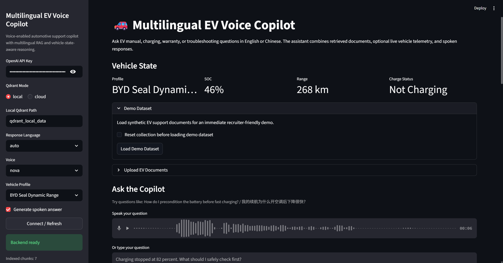
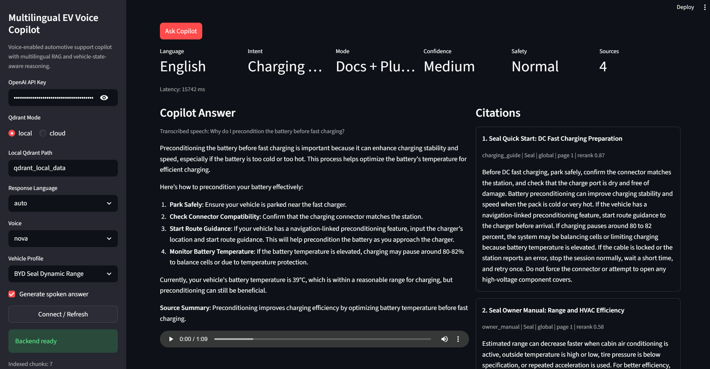
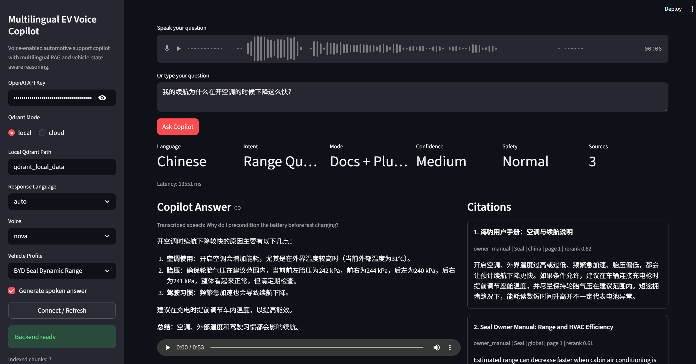

# Multilingual EV Voice Copilot

Voice-enabled RAG assistant for EV manuals, charging help, troubleshooting, and vehicle-state-aware support.

## What this project is

`Multilingual EV Voice Copilot` is a recruiter-ready automotive AI project built from a generic voice-RAG example and transformed into a more realistic EV support product.

The app answers EV questions in `English` or `Chinese`, retrieves citation-backed content from manuals and support documents, optionally combines that with mock live vehicle telemetry, and returns both text and spoken responses.

## Real app screenshots

### 1. Main app overview

This screen shows the multilingual EV support interface with vehicle state, demo loading controls, voice input, and the core copilot workflow.



### 2. English charging support answer

This screen shows an English voice-enabled answer with telemetry-aware reasoning, source-backed citations, and audio playback.



### 3. Chinese range and HVAC answer

This screen shows multilingual answering in Chinese with citation-backed retrieval and the same product-style interface.



## Why this matters

Most voice chatbot demos are generic. This project is designed to feel closer to a real automotive support assistant by combining:

- multilingual document retrieval
- voice input and text-to-speech output
- EV-specific troubleshooting flows
- metadata-aware search and reranking
- safety review for higher-risk questions
- mocked vehicle-state-aware reasoning

## Core features

- `Streamlit` UI with local demo workflow
- `English + Chinese` interaction support
- voice input via browser microphone and `OpenAI` transcription
- answer playback via `OpenAI` text-to-speech
- metadata-aware ingestion for PDFs
- local or cloud `Qdrant` support
- filtered retrieval plus lightweight reranking
- troubleshooting mode for charging and warning questions
- safety review layer for higher-risk automotive topics
- demo dataset with synthetic EV documents and mock telemetry
- analytics logging for language, intent, and safety patterns

## Quick start

### 1. Create the virtual environment

```bash
py -3 -m venv .venv
.venv\Scripts\activate
```

### 2. Install dependencies

```bash
pip install -r requirements.txt
```

### 3. Launch the app

```bash
streamlit run app.py
```

### 4. Easiest demo path

Inside the app:

- paste your `OpenAI API key`
- keep `Qdrant Mode` set to `local`
- click `Connect / Refresh`
- click `Load Demo Dataset`
- ask a question or record one with the microphone

## Sample demo questions

- `How do I precondition the battery before fast charging?`
- `Charging stopped at 82 percent. What should I safely check first?`
- `Why is my estimated range dropping while AC is on?`
- `What does this tire pressure warning mean for highway driving?`
- `我的续航为什么在开空调的时候下降这么快？`
- `快充到82%就停了，我先应该检查什么？`

## Product modes

### Manual Q&A

Answers EV manual and quick-start questions with source-backed retrieval.

### Docs + State

Adds mock vehicle telemetry for questions about range, charging, tire pressure, HVAC impact, or warning context.

### Troubleshooting

Uses a more structured answer style for issues like charging interruption, warning indicators, and service escalation.

## Project structure

```text
multilingual-ev-voice-copilot/
├── app.py
├── agents.py
├── analytics.py
├── backend.py
├── config.py
├── ingestion.py
├── retrieval.py
├── state.py
├── ui_components.py
├── vehicle_tools.py
├── voice.py
├── data/
├── evals/
├── assets/
└── prompts/
```

## Demo data included

The repo ships with synthetic public-safe EV support content in `data/demo_documents.json`, plus mock telemetry in `data/mock_vehicle_state.json`.

Included topics:

- battery preconditioning before fast charging
- charging interruptions near `80-82%`
- HVAC impact on range
- tire-pressure and warning handling
- bilingual EV support glossary terms

## Tech stack

- `Python`
- `Streamlit`
- `OpenAI`
- `Qdrant`
- `LangChain` text splitters
- `PyPDF`

## Honest limitations

- uses synthetic demo data instead of proprietary vehicle manuals
- depends on an `OpenAI API key`
- uses mocked telemetry rather than a live vehicle interface
- safety review improves behavior but is not a replacement for official service guidance

## Why this is strong for a CV

This project demonstrates:

- applied LLM product design
- RAG and metadata-aware retrieval
- multilingual UX thinking
- voice interface integration
- automotive troubleshooting workflows
- safety-aware answer generation

## Source lineage

This repo started from the voice RAG example in `repo_inspect/voice_ai_agents/voice_rag_openaisdk` and was transformed into a standalone EV-focused portfolio project.
